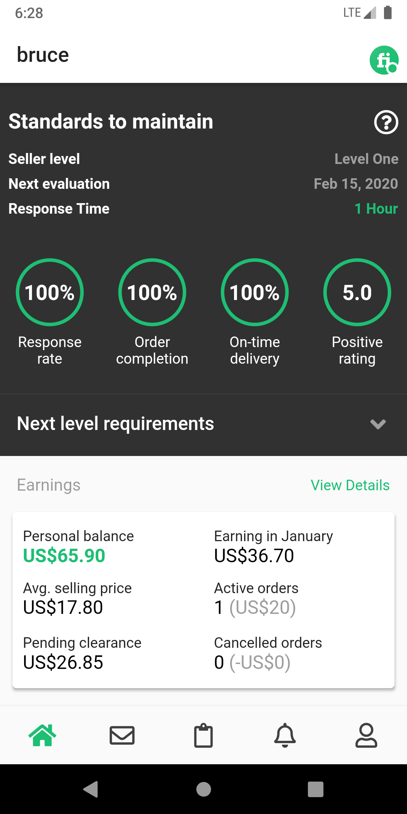
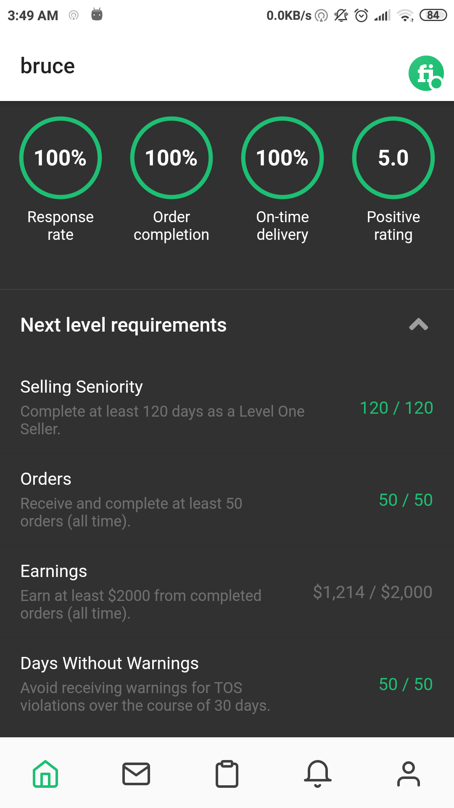
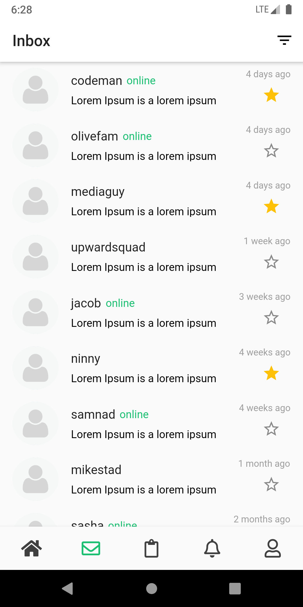
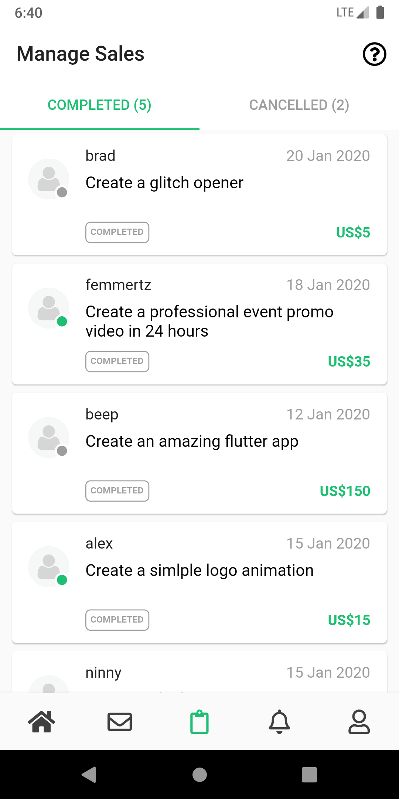
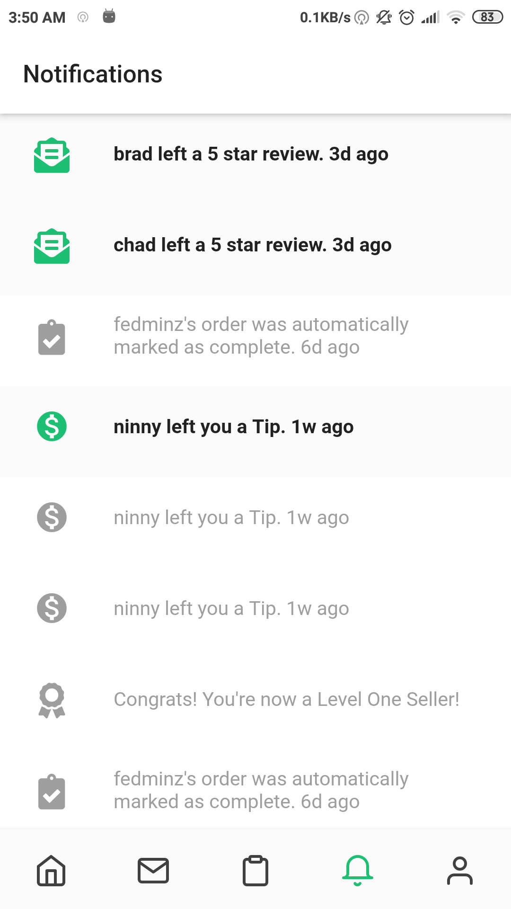
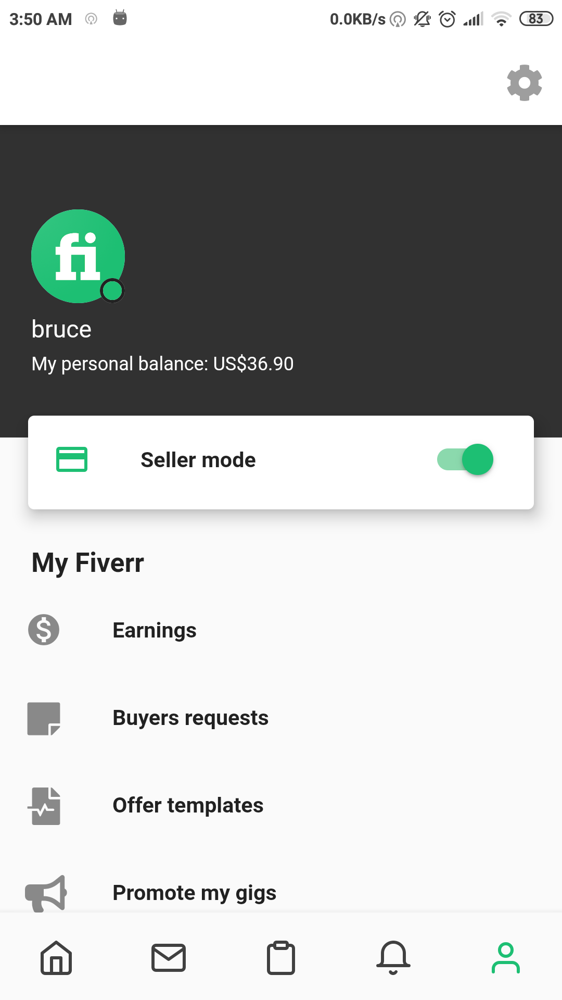
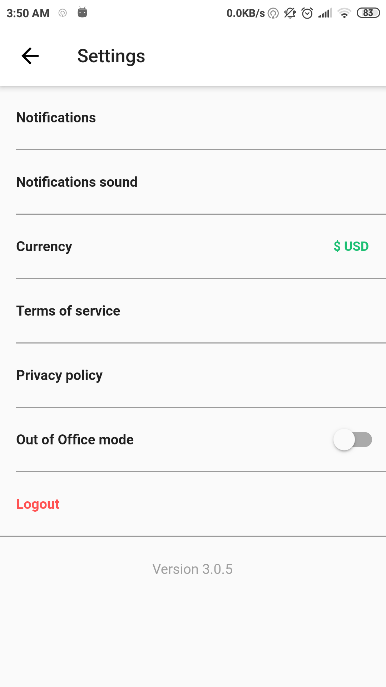
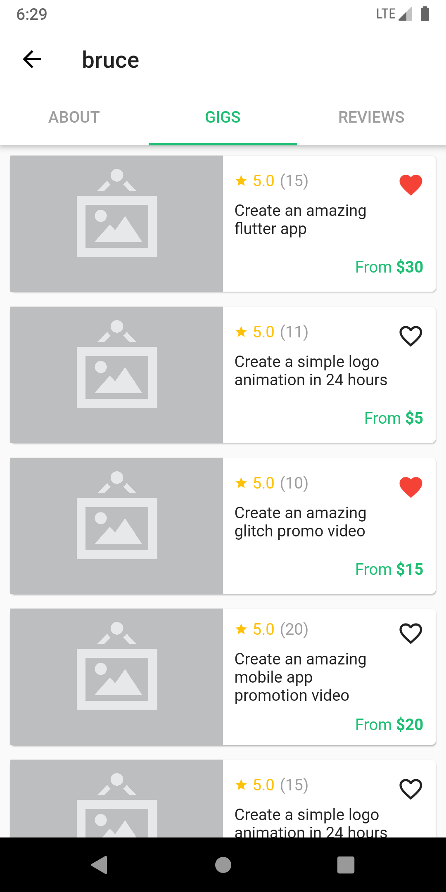
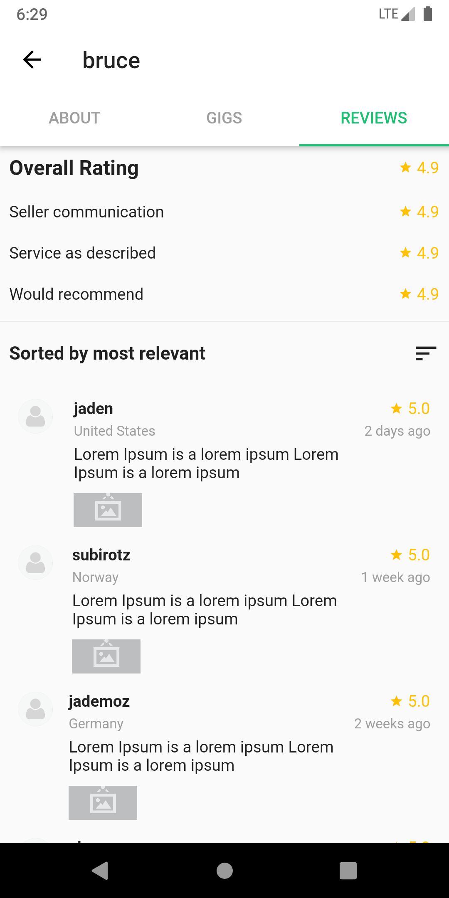

  
  

<h1 align="center">FiverrClone</h1>

    
    
    
    
    

Fiverr mobile app made with [Flutter](https://flutter.dev/)

More updates are yet to come :heart_eyes:

## Screenshots  

<table>
  <tr>
    <td></td>
    <td></td>
    <td></td>
    <td></td>
    <td></td>
  </tr>
  <tr>
    <td></td>
    <td></td>
    <td></td>
    <td></td>
    <td></td>
  </tr>
</table>
